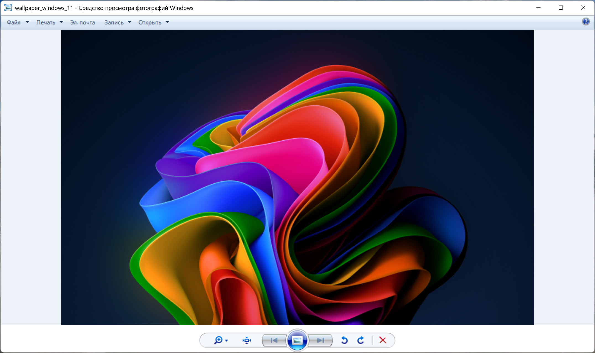

# Shell Image Viewer

*Klassischer Windows-Bildbetrachter für Windows 10 und 11.*

[](../LICENSE)
[](#)
[](#)
[](https://twitter.com/intent/tweet?text=Check%20out%20this%20awesome%20project&url=https%3A%2F%2Fgithub.com%2FAlmanex%2FClassic-Windows-image-viewer-for-Windows-11)


<p align="center">
  
</p>

---

## Überblick

Microsoft hat die klassische Windows Photo Viewer-Schnittstelle in Windows 10 und 11 entfernt, aber die zugrunde liegende Systembibliothek `shimgvw.dll` unterstützt weiterhin die Legacy-Funktionalität.

`PhotoViewer.exe` ist ein kleiner Launcher, der in C++ geschrieben wurde und `ImageView_FullscreenW` von `shimgvw.dll` aufruft, um das bekannte Vollbild-Anzeigeerlebnis wiederherzustellen.

Wenn Ihrer Systemversion `shimgvw.dll` fehlt (häufig in einigen Lite- oder „N“-Editionen), finden Sie kompatible Versionen im Verzeichnis `DLL/` dieses Projekts und können diese neben der ausführbaren Datei platzieren.

---

## Hauptfunktionen

- Vollbild-Bildbetrachtung über die originale Windows Photo Viewer-Schnittstelle.
- Automatische Suche nach der Systembibliothek `shimgvw.dll`.
- Option zur Verwendung einer lokalen Kopie der DLL, wenn die System-DLL fehlt.
- Unterstützung für das Öffnen von Dateien über Befehlszeilenargumente oder den Standard-Auswahldialog.
- Integrierte Befehlszeilenparameter für Versionsinformationen, Hilfe und Liste der unterstützten Formate.

---

## Technologie-Stack

| Komponente / Ebene | Technologie | Details / Zweck |
| --- | --- | --- |
| Programmiersprache | C++17 | Einhaltung moderner Standards für sicheren und effizienten Code |
| Build-System | CMake 3.16+ | Plattformübergreifende Build-Automatisierung |
| Benutzeroberfläche | Win32-API / Common Dialogs | Schlanker nativer Dateiauswahldialog und Informationsfenster |
| Hauptabhängigkeit | shimgvw.dll | Native Windows Photo Viewer-Bibliothek |

---

## Erste Schritte

Eine detaillierte Schritt-für-Schritt-Anleitung mit Bildern zur Einrichtung der App finden Sie im [Benutzerhandbuch](GUIDE_DE.md).

### Voraussetzungen

- Betriebssystem Windows 10/11
- CMake 3.16+ installiert
- MinGW-w64- oder MSVC-Compiler mit C++17-Unterstützung

### Erstellung und Ausführung

Führen Sie folgende Befehle im Terminal aus:

```powershell
git clone https://github.com/Almanex/Classic-Windows-image-viewer-for-Windows-11.git
cd Classic-Windows-image-viewer-for-Windows-11
cmake -B build -G "MinGW Makefiles"
cmake --build build --config Release
```

Die ausführbare Datei wird in `release/PhotoViewer.exe` erstellt.

---

## Tests ausführen

Das Projekt enthält keine automatisierten Unit-Tests. Tests werden manuell durch Ausführen der ausführbaren Datei mit verschiedenen Parametern durchgeführt:

```powershell
release/PhotoViewer.exe /?
release/PhotoViewer.exe --about
release/PhotoViewer.exe --formats
```

---

## Bereitstellung

Um die Anwendung bereitzustellen, kopieren Sie einfach die kompilierte Datei `PhotoViewer.exe` auf das Zielsystem.

> [!WARNING]
> **Windows Defender SmartScreen** kann den Start der Anwendung beim ersten Mal blockieren.
> * **Grund**: Die Anwendung ist nicht mit einem kostenpflichtigen Entwicklerzertifikat signiert, was bei kostenlosen Open-Source-Projekten üblich ist.
> * **Anleitung**: Um diese Warnung zu umgehen, klicken Sie auf **„Weitere Informationen“** (More info) und wählen Sie dann **„Trotzdem ausführen“** (Run anyway).

---

## Beitragen

Wir freuen uns über jeden Beitrag zur Verbesserung des Projekts! Sie können Fehlerberichte (Issues) erstellen oder eigene Korrekturen (Pull Requests) einreichen.

---

## Lizenz

Das Projekt ist unter der freien MIT-Lizenz lizenziert. Weitere Details finden Sie in der Datei [LICENSE](../LICENSE).
